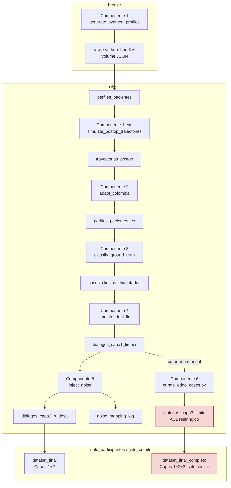

# Generador de datos — Dataset Seguimiento Post-Operatorio

> Documentación de referencia para quien despliegue, corra o audite el generador de
> datos del Reto Tech Sphere 2026. Complementa (no reemplaza) el diseño técnico original:
> `specs/Diseño Técnico — Dataset Seguimiento Post-Operatorio.md` documenta el *por qué*
> de cada decisión; este documento describe el pipeline *tal como está implementado hoy*
> en `src/postop/`, y cómo ponerlo en marcha.

## 1. Resumen

El generador produce un dataset sintético de conversaciones de seguimiento
post-operatorio (paciente ↔ agente de voz), en **3 capas**:

- **Capa 1 (limpia)** — transcripciones generadas por un par de LLMs (paciente/agente)
  sobre un caso clínico ya etiquetado 🟢/🟡/🔴.
- **Capa 2 (ruidosa)** — la misma Capa 1 con ruido conversacional inyectado
  (STT, modismos, ambigüedad, contradicciones, información faltante, cambio de
  interlocutor), con trazabilidad completa hacia el turno original.
- **Capa 3 (casos límite)** — un conjunto curado a mano, con categorías clínicas
  específicas (alarma real, falso positivo, solicitud de diagnóstico, PII mezclada),
  reservado al comité evaluador.

Todo el dataset es **sintético**: ningún paciente, nombre, dirección o número de
documento corresponde a una persona real, en ninguna capa.

## 2. Arquitectura

### 2.1 Componentes y flujo de datos

El pipeline corre como 6 componentes encadenados sobre Unity Catalog (Delta), más un
paso de publicación:



| # | Componente | Script | Escribe |
|---|---|---|---|
| 1 | Generación clínica base | `src/postop/generate_synthea_profiles.py` | `bronze.raw_synthea_bundles`, `silver.perfiles_pacientes` |
| 1 (ext.) | Trayectorias post-op | `src/postop/simulate_postop_trajectories.py` | `silver.trayectorias_postop` |
| 2 | Adaptación a Colombia | `src/postop/adapt_colombia.py` | `silver.perfiles_pacientes_co` |
| 3 | Motor de ground-truth | `src/postop/classify_ground_truth.py` | `silver.casos_clinicos_etiquetados` |
| 4 | Simulación dual-LLM | `src/postop/simulate_dual_llm.py` | `silver.dialogos_capa1_limpia` |
| 5 | Inyector de ruido | `src/postop/inject_noise.py` | `silver.dialogos_capa2_ruidosa`, `silver.noise_mapping_log` |
| 6 | Curaduría de casos límite (manual) | `notebooks/curate_edge_cases.py` | `silver.dialogos_capa3_limite` |
| — | Publicación gold | `src/postop/publish_gold.py` | grants + `gold_participantes.dataset_final`, `gold_comite.dataset_final_completo` |

El DAG automático (`resources/postop_pipeline.job.yml`) encadena los componentes 1-5 más
`publish_gold` como un único Databricks Workflow con `max_concurrent_runs: 1`. El
Componente 6 corre **deliberadamente fuera** de ese job: es curaduría humana, no
generación automática.

### 2.2 Modelo de catálogo (Unity Catalog)

```
postop_dataset (catalog)
├── bronze
│   └── raw_synthea_bundles          (Volume)
├── silver
│   ├── perfiles_pacientes
│   ├── trayectorias_postop
│   ├── perfiles_pacientes_co
│   ├── casos_clinicos_etiquetados
│   ├── dialogos_capa1_limpia
│   ├── dialogos_capa2_ruidosa
│   ├── noise_mapping_log
│   └── dialogos_capa3_limite        (ACL restringido — solo comité)
├── gold_participantes
│   └── dataset_final                (Capas 1+2)
└── gold_comite
    └── dataset_final_completo       (Capas 1+2+3)
```

Dos esquemas *gold* separados por audiencia son lo que oculta la Capa 3 a los equipos
participantes de forma nativa (grants, no lógica de aplicación) — ver
`sql/ddl/30_publish_gold_grants.sql`.

### 2.3 Proveedores de LLM (Componente 4)

`simulate_dual_llm.py` soporta tres proveedores intercambiables detrás del mismo
contrato (`--llm-provider`):

| Proveedor | Flag | Estado |
|---|---|---|
| Anthropic API | `anthropic` (default en `databricks.yml`) | Validado en corrida real (Plan 07/08); sin cuota diaria, factura por token desde la primera llamada |
| OpenRouter (modelos `:free`) | `openrouter` | Validado (Plan 06); cuota diaria dura de cuenta, se agota rápido |
| Databricks Model Serving | `databricks` | Sin validar en este workspace |

Las credenciales siempre se leen de un **Databricks Secret Scope** (`--secret-scope`,
claves `anthropic-api-key` / `openrouter-api-key`) — nunca hardcodeadas en código ni en
`databricks.yml`.

## 3. Criterios de diseño

- **El ground-truth nunca lo asigna el LLM.** `classify_ground_truth.py` corre *antes*
  de generar cualquier conversación, sobre el vector de síntomas crudo. Si el label se
  infiriera de la transcripción o lo decidiera el LLM, el dataset sería circular y no
  serviría como referencia objetiva de evaluación.
- **Ningún LLM ve el label durante la generación.** Los prompts de paciente/agente
  (`prompts/patient_system.md`, `prompts/agent_system.md`) están anclados al caso
  clínico pero excluyen explícitamente 🟢/🟡/🔴; el label se adjunta como metadata
  *después* de generar la transcripción.
- **La adaptación geográfica es post-proceso declarado, no oculto.** `adapt_colombia.py`
  reemplaza nombres/direcciones/documento/EPS manteniendo intactos los módulos clínicos,
  y dos escribe columnas de auditoría (`source_country`, `adapted_country`,
  `adaptation_fields`, `adaptation_ts`) en `silver.perfiles_pacientes_co` — la
  sustitución vive en el dato, no solo en este documento.
- **El muestreo geográfico usa pesos poblacionales reales (DANE), no uniformes** — así
  la distribución agregada de departamentos/ciudades se parece a la distribución real
  del país en vez de depender de qué salió por azar (`dane_reference.py`).
- **Capa 2 nunca modifica Capa 1 in-place** — el ruido se aplica como transformación
  aparte y cada cambio queda registrado en `silver.noise_mapping_log`
  (turno afectado, tipo de ruido, intensidad, texto original vs. ruidoso, seed), que es
  el entregable de trazabilidad Capa 1 → Capa 2 exigido por la ficha del reto.
- **Capa 3 nunca pasa por el inyector de ruido ni se expone en `gold_participantes`.**
  El ACL restringido se define en el DDL desde la creación de la tabla
  (`sql/ddl/23_dialogos_capa3_limite.sql`), no como paso manual posterior.
- **Allowlist explícita de módulos clínicos** (`conf/project.yml`,
  `synthea.module_allowlist`): apendicitis, colecistitis, cáncer colorrectal, reemplazo
  articular total, cáncer de mama — elegidos por cobertura de los 6 síntomas del reto
  (dolor, fiebre, movilidad, herida, apetito, sueño), no el catálogo completo de módulos.

## 4. Referencias

- **Diseño técnico completo:**
  `specs/Diseño Técnico — Dataset Seguimiento Post-Operatorio.md` — decisiones de
  arquitectura, riesgos y mitigaciones, mapeo a entregables de la ficha del reto.
- **Ficha de especificación del reto:**
  `specs/Ficha Técnica — Dataset Seguimiento Post-Operatorio.pdf`.
- **Historial de implementación:** `Plans/01`-`09` — scaffold del bundle, ajustes para
  Databricks Free Edition, implementación real de los 6 componentes, provisión del
  proveedor LLM y corridas piloto.
- **Proyecciones de población DANE 2025** — usadas para el muestreo geográfico ponderado
  por departamento (`src/postop/dane_reference.py`, docstring del módulo con la fuente
  exacta consultada).
- **Criterios clínicos de referencia** para la calibración de trayectorias y reglas de
  clasificación (`src/postop/clinical_domains.py`, `src/postop/classify_ground_truth.py`):
  vigilancia post-quirúrgica estándar, criterios CDC de infección de sitio quirúrgico y
  SIRS para fiebre, criterios de dehiscencia de herida.
- **Contratos de datos versionados:** `sql/ddl/*.sql` — un archivo DDL por tabla, en
  paridad 1:1 con los esquemas Spark explícitos de `src/postop/schemas.py`.

## 5. Guía de instalación / puesta en marcha

Pasos para desplegar y correr el pipeline completo contra un workspace de Databricks:

```bash
# 1. Clonar el repo y crear un entorno virtual
git clone <url-del-repo>
cd techsphere_data_set
python3 -m venv .venv
source .venv/bin/activate

# 2. Instalar dependencias
pip install -r requirements.txt

# 3. Configurar credenciales del workspace de Databricks
#    (perfil de `databricks configure`, o variables de entorno)
databricks configure --host <workspace-url>
# alternativa: export DATABRICKS_HOST=... DATABRICKS_TOKEN=...

# 4. Crear el Secret Scope y guardar la API key del proveedor LLM elegido
databricks secrets create-scope postop-llm-secrets
databricks secrets put-secret postop-llm-secrets anthropic-api-key   # o: openrouter-api-key

# 5. Validar y desplegar el bundle al target dev
databricks bundle validate -t dev
databricks bundle deploy   -t dev

# 6. Correr el pipeline completo (6 componentes + publicación gold)
databricks bundle run postop_pipeline -t dev
```

Antes de desplegar, correr la suite de pruebas localmente:

```bash
pytest -q
```

El host y las credenciales del workspace **nunca** se fijan en `databricks.yml` ni en el
repo — se resuelven en el momento del despliegue (perfil local o variables de entorno).

## 6. Prerrequisitos

- **Python 3.11+** (usado en desarrollo local: 3.14) — compatible con
  `pyspark>=3.5,<4.0` según `requirements.txt`.
- **Databricks CLI** instalado y con acceso a un workspace (Free Edition es suficiente).
- **Una cuenta de Databricks** — Free Edition alcanza para correr el pipeline completo,
  con las limitaciones descritas en la sección de advertencias.
- **Una API key de un proveedor LLM externo** (Anthropic u OpenRouter) para el
  Componente 4 — sin ella, `simulate_dual_llm` no puede generar transcripciones.
- **Acceso de red saliente** desde el workspace hacia el proveedor LLM elegido
  (`api.anthropic.com` u `openrouter.ai`) — necesario porque las tasks corren en
  compute serverless de Free Edition, no en un cluster con egress configurable.
- **`pytest>=8.0`** para correr la suite de pruebas local antes de desplegar (incluida
  en `requirements.txt`).

## 7. Advertencias y limitaciones (caveats)

- **`pysynthea` de PyPI no es un generador de pacientes.** Es un downloader/query-tool
  sobre una base OMOP de Synthea ya generada y fija, sin parámetro de allowlist de
  módulos ni de seed — no cubre el caso de uso de este pipeline. El Componente 1
  (`generate_synthea_profiles.py`) usa en su lugar un **generador sintético propio**,
  determinístico y sin dependencia de runtime externo, calibrado contra los mismos 5
  módulos de la allowlist. La desviación queda declarada en el dato:
  `perfiles_pacientes.synthea_runtime = 'synthetic_fallback_sin_pysynthea'`.
- **Las reglas clínicas no están validadas por un comité todavía.** Tanto
  `classify_ground_truth.REGLA_VERSION` como la calibración de `clinical_domains.py` son
  aproximaciones de ingeniería ancladas en criterios de referencia publicados, pero
  **pendientes de validación clínica formal** antes de considerarse definitivas.
- **Databricks Free Edition es serverless-only.** No hay `job_clusters`, tipos de nodo
  ni autoscaling configurables — todas las tasks corren en compute serverless, y solo
  se permite un workspace/metastore por cuenta. El diseño técnico original asumía
  clusters clásicos; `resources/postop_pipeline.job.yml` documenta el ajuste real.
- **El nivel gratuito de OpenRouter tiene una cuota diaria dura**, confirmada
  empíricamente (no solo el límite documentado de la cuenta) — se agota rápido en
  modelos populares. El proveedor Anthropic evita esa cuota, pero factura por token
  desde la primera llamada.
- **El gate de calidad de balance de labels (§12 del diseño técnico) es no-bloqueante**
  para corridas pequeñas desde el Plan 09 — un dataset con distribución de labels
  desbalanceada puede publicarse igual; es una decisión deliberada para no bloquear un
  dataset que alimenta un modelo posterior, no un bug del pipeline.
- **La Capa 3 (casos límite) requiere curaduría humana manual.** No existe generación
  automática de `silver.dialogos_capa3_limite` — el notebook
  `notebooks/curate_edge_cases.py` es un formulario/checklist que un revisor humano debe
  completar caso por caso antes de que esos datos lleguen a `gold_comite`.
- **Todos los datos son sintéticos**, incluida la categoría `pii_mezclada` de Capa 3
  (diseñada para *parecer* PII sensible como prueba de manejo, pero nunca correspondiente
  a una persona real). No usar este pipeline para procesar datos de pacientes reales.
