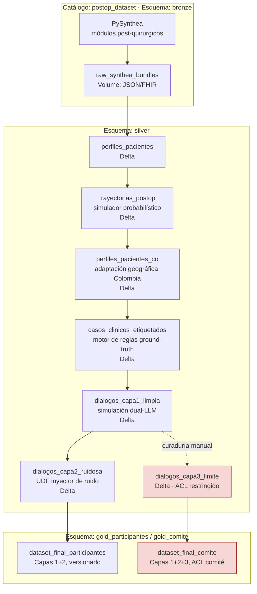

# 🛠️ Diseño Técnico — Dataset Reto Tech Sphere 2026

**Reto:** Agente de voz para seguimiento post-operatorio de pacientes
**Basado en:** `Ficha Técnica — Dataset Seguimiento Post-Operatorio.pdf`
**Autor:** Gabriel Cepeda (rol: Data Engineer del proyecto)
**Fecha:** 2026-07-15
**Propósito:** traducir la ficha de especificación (negocio + decisiones de herramientas) en un
diseño técnico ejecutable sobre Databricks — esquemas, jobs, contratos de datos, gobierno y
plan de validación. Este documento es el complemento de ingeniería de la ficha; no repite las
decisiones ya tomadas ahí (Synthea como base clínica, dual-LLM manual, PySynthea como
runtime recomendado), las **implementa**.

---

## 1. Resumen ejecutivo

El pipeline construye el dataset en **6 componentes** que corren como un DAG de Databricks
Workflows sobre Unity Catalog, con salida en 3 capas (limpia / ruidosa / casos límite) más un
catálogo de gobierno para ocultar la Capa 3 al resto de participantes:

1. **Generación clínica base** — PySynthea produce pacientes + procedimiento quirúrgico + comorbilidades.
2. **Expansión temporal post-operatoria** — gap identificado en la ficha (ver §5.3): Synthea no genera por defecto una serie diaria de síntomas de seguimiento con la granularidad que exige el reto. Se propone un simulador probabilístico complementario.
3. **Adaptación geográfica Colombia** — reemplazo de la capa demográfica en post-proceso.
4. **Motor de clasificación ground-truth** — reglas clínicas determinísticas (no LLM) que asignan 🟢/🟡/🔴 a partir del vector de síntomas, *antes* de generar la conversación.
5. **Simulación dual-LLM** — convierte el caso clínico + label en una transcripción de llamada.
6. **Inyección de ruido (Capa 2)** y **curaduría de casos límite (Capa 3)**.

Todo se materializa en Delta/Unity Catalog, versionado por capa, con ACLs que separan lo que
reciben los equipos participantes de lo que se reserva para evaluación del comité.

---

## 2. Objetivos y no-objetivos de este diseño

**Objetivos:**
- Especificar contratos de datos (esquemas Delta) entre cada etapa del pipeline.
- Resolver con código el mecanismo de trazabilidad Capa 1 → Capa 2 exigido como entregable.
- Definir cómo se orquesta el llamado a LLM (costo, paralelismo, reintentos) sin infraestructura ad-hoc.
- Definir el modelo de gobierno en Unity Catalog que oculta la Capa 3.
- Dejar explícito el criterio clínico que genera el ground-truth (no puede ser "lo que diga el LLM").

**No-objetivos (fuera de alcance de este documento):**
- Diseño del agente de voz de los equipos participantes (eso lo construyen ellos).
- Rúbrica de evaluación final del reto (referenciada en la ficha, sección 7, pendiente del comité).
- Locución/TTS — el dataset entrega **transcripciones de texto**, no audio. Si el comité decide
  agregar audio sintético (TTS) en una fase posterior, este diseño lo soporta como un componente
  7 adicional sin romper el contrato de las capas 1-3 (ver §16, riesgo R5).

---

## 3. Arquitectura general



---

## 4. Modelo de catálogo (Unity Catalog)

Un único catálogo dedicado al reto, tres esquemas por medallion, y dos esquemas *gold*
separados por audiencia (esto es lo que resuelve el requisito "ocultar Capa 3 a participantes"
de forma nativa, sin lógica de aplicación):

```
postop_dataset (catalog)
├── bronze
│   └── raw_synthea_bundles          (Volume, JSON/FHIR crudo de PySynthea)
├── silver
│   ├── perfiles_pacientes
│   ├── trayectorias_postop
│   ├── perfiles_pacientes_co
│   ├── casos_clinicos_etiquetados
│   ├── dialogos_capa1_limpia
│   ├── dialogos_capa2_ruidosa
│   ├── noise_mapping_log            (trazabilidad capa1 -> capa2)
│   └── dialogos_capa3_limite        (ACL: solo grupo comite_academico)
├── gold_participantes
│   └── dataset_final                (vista/tabla publicada a equipos: capas 1+2 solamente)
└── gold_comite
    └── dataset_final_completo       (capas 1+2+3, para evaluación objetiva)
```

**Grants (ejecutar como parte del job de publicación, no manualmente):**

```sql
CREATE CATALOG IF NOT EXISTS postop_dataset;
CREATE SCHEMA IF NOT EXISTS postop_dataset.gold_comite;

GRANT USE CATALOG ON CATALOG postop_dataset TO `equipos_participantes`, `comite_academico`;
GRANT USE SCHEMA, SELECT ON SCHEMA postop_dataset.gold_participantes TO `equipos_participantes`;
GRANT USE SCHEMA, SELECT ON SCHEMA postop_dataset.gold_comite TO `comite_academico`;

-- Explícito: nadie fuera del comité puede ver silver.dialogos_capa3_limite ni gold_comite
REVOKE SELECT ON SCHEMA postop_dataset.silver FROM `equipos_participantes`;
REVOKE SELECT ON SCHEMA postop_dataset.gold_comite FROM `equipos_participantes`;
```

Esto además da **lineage automático** (Unity Catalog lineage graph) entre `dialogos_capa1_limpia`
→ `dialogos_capa2_ruidosa`, que sirve como evidencia complementaria (no sustituta) del
entregable "documentación de mapeo Capa 1 → Capa 2".

---

## 5. Componente 1 — Generación clínica base

### 5.1 Selección de módulos Synthea/PySynthea

Módulos con procedimiento quirúrgico + plan de cuidado post-operatorio nativo en el catálogo
estándar de Synthea, priorizados por relevancia a los 6 síntomas del reto (dolor, fiebre,
movilidad, herida, apetito, sueño):

| Módulo Synthea | Procedimiento | Por qué aplica |
|---|---|---|
| `appendicitis` | Apendicectomía | Post-op agudo corto, riesgo de infección de sitio quirúrgico bien documentado |
| `cholecystitis` | Colecistectomía | Similar; buen contraste laparoscópico vs abierto |
| `colorectal_cancer` | Colectomía | Post-op más largo, mayor probabilidad de complicaciones (útil para 🔴) |
| `total_joint_replacement` | Reemplazo de cadera/rodilla | Foco en movilidad — dimensión que los otros módulos no cubren bien |
| `breast_cancer` | Mastectomía | Post-op con manejo de herida/drenajes, casos de ansiedad del paciente (útil para casos límite Capa 3) |

**Acción de ingeniería:** el script de generación de perfiles (entregable §17) debe declarar
explícitamente esta lista de módulos como *allowlist* — no correr Synthea "a ciegas" contra todo
su catálogo de módulos (cientos, mayoría irrelevante al reto y costosos en tiempo de generación).

### 5.2 Synthea (Java) vs PySynthea — plan de validación del riesgo

La ficha ya marca esto como riesgo abierto (§4, "PySynthea es muy reciente"). Plan concreto de
mitigación, para no bloquear el proyecto en caso de que PySynthea no cubra los 5 módulos:

1. **Spike de 1 día** al inicio del proyecto: correr los 5 módulos de §5.1 en PySynthea, diff
   contra la salida del Synthea `.jar` original para los mismos `seed`. Confirmar que
   observations/procedures relevantes (dolor, temperatura, estado de herida si existe) están presentes.
2. Si PySynthea cubre ≥4/5 módulos con fidelidad aceptable → usar PySynthea, correr el módulo
   faltante vía el `.jar` original como **Job Task tipo JAR** (patrón `rwe-lakehouse`) y unir ambas
   salidas en `bronze.raw_synthea_bundles` (mismo esquema JSON/FHIR, misma tabla).
3. Si PySynthea falla en general → fallback completo a Synthea `.jar`, penalización de fricción
   JVM pero sin bloquear el cronograma; el resto del pipeline (Colombia, dual-LLM, ruido) no
   depende de qué runtime generó el bronze.

Este spike debe ejecutarse **antes** de comprometer fechas de entrega al comité — es el único
punto de la arquitectura con riesgo de proveedor/madurez de librería.

### 5.3 Brecha identificada: granularidad temporal de seguimiento

**Este es el hallazgo de ingeniería más importante de este documento, no cubierto explícitamente
en la ficha.**

Synthea modela historias clínicas realistas a nivel de *encounters* (encuentros clínicos:
cirugía, controles ambulatorios, eventualmente readmisión si hay complicación) — pero el reto
necesita **llamadas de seguimiento diarias o cada 2-3 días** durante la primera(s) semana(s)
post-operatoria, con un vector de 6 síntomas por llamada. Los módulos de Synthea no generan esa
serie diaria de forma nativa: dan el resultado final (recuperación normal vs readmisión) pero no
la trayectoria día a día que una llamada de seguimiento necesita capturar.

**Decisión propuesta:** agregar un componente `trayectorias_postop` — un simulador probabilístico
en Python (no un módulo GMF de Synthea; se mantiene la misma filosofía que ya usa la ficha para
evitar el DSL de Synthea) que:

- Toma como entrada el perfil de `perfiles_pacientes` (procedimiento, edad, comorbilidades, si
  Synthea marcó una complicación en el encounter posterior).
- Genera una serie de N llamadas (día 1, 3, 7, 14 — configurable) con un vector de 6 síntomas por
  llamada, siguiendo uno de 3 arquetipos de trayectoria calibrados contra criterios clínicos
  publicados (no inventados): recuperación normal, complicación leve/vigilancia (basado en
  criterios de vigilancia post-quirúrgica estándar), complicación real (criterios CDC de
  infección de sitio quirúrgico / SIRS para fiebre + criterios de dehiscencia de herida).
- El arquetipo elegido para cada paciente es *consistente* con lo que Synthea generó en su
  encounter (p. ej., si Synthea generó una readmisión por infección, la trayectoria debe
  converger a 🔴 antes de esa fecha — no puede haber contradicción entre bronze y la trayectoria).

Esto no reemplaza el módulo clínico de Synthea (que sigue intacto por decisión de la ficha), lo
**complementa**: Synthea decide *qué le pasó* al paciente a nivel macro, el simulador de
trayectorias decide *cómo se ve eso* en una serie de llamadas de seguimiento con resolución diaria.

> ⚠️ Esto es una extensión de alcance frente a la ficha original y debe validarse con el comité
> antes de implementarse — se documenta aquí porque sin ella, el dataset no tiene material
> suficiente para simular *series* de llamadas (solo un snapshot por paciente), lo cual limita
> severamente la evaluación de la capacidad de seguimiento longitudinal del agente de voz.

---

## 6. Componente 2 — Adaptación geográfica a Colombia

Ejecuta exactamente la resolución de la ficha (§3): módulos clínicos intactos, capa demográfica
reemplazada en post-proceso, con la sustitución **declarada** en metadata de la tabla (no oculta).

| Campo Synthea (US) | Reemplazo Colombia | Fuente |
|---|---|---|
| `first`, `last` (nombres) | Nombres colombianos | `Faker(locale="es_CO")` |
| `address`, `city`, `state`, `zip` | Direcciones/ciudades colombianas | `Faker(locale="es_CO")` + tabla de referencia DANE (departamentos/municipios) |
| `ssn` | Número de documento (CC) sintético, formato válido pero no real | Generador propio, rango no colisionable con cédulas reales |
| Proveedor de seguro (`payer`) | EPS colombiana (lista pública: Sura, Sanitas, Compensar, Nueva EPS, etc.) | Lista curada estática |
| `healthcare_expenses`, `healthcare_coverage` | Se **omiten** del dataset final si el reto no evalúa costos (decisión ya tomada en la ficha) | — |

**Implementación:** función pura `adapt_to_colombia(df: DataFrame) -> DataFrame`, aplicada como
transformación estándar de PySpark/pandas (tal como indica la ficha, "no como módulo GMF").
Determinística por `seed` por paciente para reproducibilidad (mismo `patient_id` → mismos datos
colombianos sintéticos en cualquier re-ejecución).

**Columna de auditoría obligatoria** en `silver.perfiles_pacientes_co`:

```
source_country       STRING   -- 'US' (valor original antes de adaptar)
adapted_country       STRING   -- 'CO'
adaptation_fields      ARRAY<STRING>  -- columnas efectivamente reemplazadas
adaptation_ts           TIMESTAMP
```

Esto es lo que responde directamente al criterio de rechazo §7 de la ficha ("ausencia de manejo
explícito del sesgo geográfico... sin declarar el post-proceso") — la declaración vive en el dato,
no solo en un documento aparte.

---

## 7. Componente 3 — Motor de clasificación ground-truth

**Principio de diseño clave: el ground-truth NO lo asigna el LLM.** Se asigna con un motor de
reglas clínicas determinístico *antes* de generar la conversación; el LLM solo tiene la tarea de
verbalizar un caso ya etiquetado. Si el label lo decidiera el LLM (o se infiriera de la
transcripción después), el dataset no serviría como referencia objetiva — sería circular.

Reglas (ejemplo simplificado, a validar/calibrar con criterio clínico del comité antes de
congelar):

```python
def classify(sintomas: dict) -> str:
    # 🔴 escalar — cualquier bandera roja individual basta
    if (sintomas["fiebre_c"] >= 38.5
        or sintomas["herida"] in ("dehiscencia", "secrecion_purulenta")
        or sintomas["dolor_nrs"] >= 8
        or sintomas["movilidad"] == "incapacitante_nueva"):
        return "rojo"

    # 🟡 vigilar — combinación de señales moderadas
    señales_amarillas = sum([
        sintomas["fiebre_c"] >= 37.8,
        sintomas["dolor_nrs"] >= 5,
        sintomas["herida"] == "eritema_leve",
        sintomas["apetito"] == "muy_disminuido",
        sintomas["sueño"] == "muy_alterado",
    ])
    if señales_amarillas >= 2:
        return "amarillo"

    return "verde"
```

- Vive en `silver.casos_clinicos_etiquetados` junto con el vector de síntomas de entrada — **la
  regla y el label quedan versionados junto al dato**, no en un notebook desconectado.
- Este motor es también el que valida la Capa 3 (casos límite): un caso curado a mano que no sea
  reproducible por o consistente con este motor de reglas es una señal de calidad a revisar antes
  de aceptarlo (no significa que la Capa 3 deba ser 100% predecible por la regla — de hecho varios
  casos límite existen *para* poner a prueba los bordes de la regla — pero si un caso "normal"
  cae fuera de toda justificación clínica, es un caso mal curado).

---

## 8. Componente 4 — Simulación conversacional dual-LLM

### 8.1 Contrato de prompts

Dos roles, cada uno con su propio system prompt, ambos anclados al mismo caso clínico:

- **LLM-paciente**: recibe el vector de síntomas + perfil colombiano + un "estilo de habla"
  (parámetro: colaborativo / evasivo / ansioso / minimizador de síntomas / confundido) y
  **no conoce el label**. Su tarea es responder de forma natural, sin revelar directamente el
  diagnóstico esperado.
- **LLM-agente**: recibe únicamente el guion de preguntas de seguimiento (dolor, fiebre,
  movilidad, herida, apetito, sueño) — **tampoco conoce el label** — y debe conducir la llamada
  recolectando la información, igual que tendría que hacerlo el agente de voz real que los equipos
  construirán.

Ninguno de los dos LLMs ve el label 🟢/🟡/🔴 — el label solo se adjunta como metadata *después* de
generar la transcripción, para no contaminar el lenguaje generado con la clasificación (fuga de
información que invalidaría la evaluación).

### 8.2 Orquestación de llamadas LLM en Databricks

- **Sin infraestructura adicional**, tal como indica la ficha: se invoca vía **Databricks Model
  Serving** (endpoint de foundation model, `ai_query()` en SQL o Python SDK) o vía API externa
  usando **Databricks Secrets** para las credenciales — nunca hardcodeadas en notebook.
- Paralelismo: distribuir la simulación de conversaciones con `mapInPandas` / `applyInPandas`
  sobre Spark, un caso clínico por partición-fila, con:
  - **Rate limiting** explícito (semáforo/backoff) para no saturar el endpoint.
  - **Checkpointing por caso**: cada conversación completa se escribe inmediatamente a Delta
    (append), de forma que un fallo a mitad del batch no obliga a re-generar (y re-pagar) los
    casos ya completados. Usar `MERGE` idempotente por `caso_id` para reintentos seguros.
- **Control de costo**: log de tokens de entrada/salida por llamada en una columna de la tabla de
  resultado (`prompt_tokens`, `completion_tokens`), agregable para reporte de costo al comité.

### 8.3 Esquema de salida — `silver.dialogos_capa1_limpia`

```
dialogo_id            STRING   -- PK
caso_id               STRING   -- FK a casos_clinicos_etiquetados
paciente_id           STRING   -- FK a perfiles_pacientes_co
dia_postop             INT
turno_idx              INT      -- orden dentro de la conversación
hablante               STRING   -- 'paciente' | 'agente'
texto                  STRING
label_ground_truth     STRING   -- 'verde' | 'amarillo' | 'rojo' (a nivel de caso, no de turno)
estilo_paciente         STRING   -- colaborativo/evasivo/ansioso/...
modelo_paciente         STRING   -- id del modelo LLM usado
modelo_agente           STRING
prompt_tokens          INT
completion_tokens       INT
generado_ts             TIMESTAMP
```

Restricción Delta:
```sql
ALTER TABLE silver.dialogos_capa1_limpia
  ADD CONSTRAINT label_valido CHECK (label_ground_truth IN ('verde','amarillo','rojo'));
```

---

## 9. Componente 5 — Inyector de ruido (Capa 2)

### 9.1 Taxonomía de ruido (parametrizable, intensidad 1-5)

| Tipo de ruido | Ejemplo de transformación | Nivel típico |
|---|---|---|
| Ruido STT | sustitución fonética, palabras cortadas, `[inaudible]` | 1-5 (probabilidad de aplicar por token) |
| Modismos regionales | "me duele durísimo" en vez de "dolor intenso" | 1-3 |
| Respuesta ambigua | reemplazar respuesta directa por evasiva/parcial | 2-4 |
| Contradicción | inyectar una afirmación que contradice un turno anterior | 3-5 |
| Información faltante | eliminar 1+ turnos de respuesta a una pregunta clave | 2-5 |
| Cambio de interlocutor | insertar turnos de un tercero (familiar/cuidador) a mitad de la llamada | 3-5 |

### 9.2 Trazabilidad Capa 1 → Capa 2 (entregable obligatorio de la ficha, §6)

Esta es la pieza que responde directamente al criterio de rechazo "dataset sin distinción entre
capas, sin poder aislar el efecto del ruido". Cada transformación de ruido escribe una fila en
`silver.noise_mapping_log`:

```
mapping_id             STRING   -- PK
dialogo_id_capa1        STRING   -- FK
dialogo_id_capa2        STRING   -- FK
turno_idx_afectado       INT
tipo_ruido               STRING
intensidad               INT      -- 1-5
texto_original           STRING
texto_ruidoso             STRING
seed                    INT      -- reproducibilidad
aplicado_ts               TIMESTAMP
```

Esto permite tres cosas que un simple "before/after" no da:
1. Medir degradación de clasificación **por tipo específico de ruido** (agregando por
   `tipo_ruido`), que es exactamente el objetivo de evaluación que pide la ficha.
2. Reproducir determinísticamente cualquier fila de Capa 2 desde su `seed` + Capa 1.
3. Auditar que el ground-truth (`label_ground_truth`, heredado sin cambios desde Capa 1) nunca se
   recalculó a partir de la versión ruidosa — el ruido afecta la *conversación*, nunca el label.

Implementación como **UDF de Spark parametrizable por `intensidad` (1-5)**, aplicada sobre
`dialogos_capa1_limpia`, nunca in-place (Capa 1 es inmutable una vez generada).

---

## 10. Componente 6 — Casos límite (Capa 3)

Categorías mínimas (de la ficha): alarma real inequívoca, falso positivo/paciente ansioso,
solicitud de diagnóstico directo, PII sensible mezclada en el discurso del paciente.

- **Curaduría manual**, no generación automática — notebook de trabajo con formulario/checklist
  de validación clínica por caso (revisor humano marca `validado_por`, `criterio_clinico_ref`).
- Escribe a `silver.dialogos_capa3_limite`, con el mismo esquema que Capa 1 más:
  ```
  categoria_caso_limite   STRING   -- alarma_real | falso_positivo | solicitud_diagnostico | pii_mezclada
  validado_por            STRING
  criterio_clinico_ref     STRING   -- referencia al protocolo que justifica el label esperado
  ```
- **Nunca** pasa por el inyector de ruido de Capa 2 ni se expone en `gold_participantes`.
- Grant restringido desde el momento de creación de la tabla (§4) — no depender de un paso manual
  posterior de "recordar restringir el acceso".

---

## 11. Orquestación — Databricks Workflows

Se recomienda modelar el proyecto como **Databricks Asset Bundle (DAB)**: todo el pipeline
(clusters, jobs, permisos) definido como código en `databricks.yml`, desplegable a un workspace
dev y luego al de entrega, con versionado en Git — esto también resuelve el entregable "scripts
documentados" de forma más robusta que notebooks sueltos.

```
postop-dataset/
├── databricks.yml
├── resources/
│   └── postop_pipeline.job.yml
├── src/
│   ├── generate_synthea_profiles.py     # Componente 1
│   ├── simulate_postop_trajectories.py  # Componente 1 (§5.3)
│   ├── adapt_colombia.py                # Componente 2
│   ├── classify_ground_truth.py         # Componente 3
│   ├── simulate_dual_llm.py             # Componente 4
│   ├── inject_noise.py                  # Componente 5
│   └── publish_gold.py                  # Grants + views finales
└── notebooks/
    └── curate_edge_cases.py             # Componente 6 (manual, human-in-the-loop)
```

DAG de tareas (Databricks Workflow, un job con dependencias explícitas):

```
generate_synthea_profiles
        │
        ▼
simulate_postop_trajectories
        │
        ▼
adapt_colombia
        │
        ▼
classify_ground_truth
        │
        ▼
simulate_dual_llm  ───────────────► [curate_edge_cases]  (manual, fuera del job automático)
        │                                    │
        ▼                                    ▼
inject_noise                         (validación clínica, luego merge)
        │                                    │
        └──────────────┬─────────────────────┘
                        ▼
                 publish_gold  (grants + dataset_final por audiencia)
```

Clusters: `generate_synthea_profiles` y `simulate_postop_trajectories` corren en **single-node**
(carga no distribuida, PySynthea/pandas); `simulate_dual_llm` e `inject_noise` en cluster
autoscaling (paralelismo de I/O hacia el endpoint LLM / transformación de texto sobre volumen
mayor de filas).

---

## 12. Calidad de datos

Además de los `CHECK` constraints ya mencionados, cada tabla silver/gold corre expectativas antes
de publicarse (Delta Live Tables expectations o validación explícita en `publish_gold.py`):

- `perfiles_pacientes_co`: no nulos en campos demográficos clave; `adapted_country = 'CO'` en 100% de filas.
- `casos_clinicos_etiquetados`: distribución de labels no degenerada (ningún label con <10% ni >70% de representación — evita un dataset trivialmente desbalanceado).
- `dialogos_capa1_limpia`: cada `caso_id` tiene ≥1 turno de paciente y ≥1 de agente; ningún turno vacío.
- `noise_mapping_log`: cada fila de `dialogos_capa2_ruidosa` tiene al menos una fila de mapping asociada (ninguna transformación "silenciosa").
- `dialogos_capa3_limite`: 100% de filas con `validado_por` no nulo antes de publicar a `gold_comite`.

Job falla (no publica) si alguna expectativa crítica no se cumple — evita que un dataset roto
llegue a `gold_participantes`.

---

## 13. Seguridad y gobierno

- **PII sintética, no real** en todas las capas excepto la categoría deliberada `pii_mezclada` de
  Capa 3 (que también es sintética, pero diseñada para parecer sensible como prueba de manejo).
  Etiquetar explícitamente esa columna para que nunca se confunda con PII real accidental.
- Secrets (API keys de LLM externo) vía **Databricks Secret Scopes**, nunca en notebook ni en
  `databricks.yml`.
- Unity Catalog **lineage** activado por defecto — usarlo como evidencia auditable adicional en la
  presentación al comité.
- Todas las tablas versionadas por Delta **time travel** — permite reconstruir el estado del
  dataset en cualquier punto de la generación si el comité pide auditar una versión anterior.

---

## 14. Costos y dimensionamiento

- Volumen estimado: definir con el comité el N de pacientes objetivo; como referencia de diseño,
  cada paciente con 4 llamadas de seguimiento (§5.3) genera ~4 conversaciones × ~10-15 turnos ×
  2 llamadas LLM por turno (paciente + agente) — dimensionar el presupuesto de tokens del
  endpoint de Model Serving en función de ese N antes de correr el batch completo.
- Ejecutar primero un **piloto de 20-30 pacientes** end-to-end (las 3 capas) para validar costo
  real por caso antes de escalar al volumen completo — evita sorpresas de facturación en
  Model Serving/API externa.

---

## 15. Riesgos técnicos y mitigaciones

| Riesgo | Impacto | Mitigación |
|---|---|---|
| R1. PySynthea no cubre módulos post-op con fidelidad | Bloquea Componente 1 | Spike de validación §5.2 antes de comprometer fechas; fallback a Synthea `.jar` vía Job Task JAR |
| R2. Gap de granularidad temporal (§5.3) no se resuelve a tiempo | Dataset sin series de seguimiento reales | Validar alcance del simulador de trayectorias con el comité en la primera semana del proyecto |
| R3. Costo de llamadas LLM se dispara con el volumen completo | Sobrecosto / bloqueo de presupuesto | Piloto de 20-30 casos antes de escalar (§14); checkpointing idempotente evita re-pagar reintentos |
| R4. Fuga de label hacia el LLM contamina el lenguaje generado | Dataset no sirve como evaluación objetiva | Diseño de prompts en §8.1 garantiza que ningún LLM ve el label; label se adjunta post-hoc |
| R5. Comité pide audio (TTS) más adelante | Requiere componente nuevo no cubierto aquí | Arquitectura de capas en Delta ya soporta anexar `audio_uri` por `dialogo_id` sin romper esquema existente |
| R6. Grant mal configurado expone Capa 3 a participantes | Invalida el examen objetivo del comité | Grants definidos como código en el mismo job de publicación (§4, §11), no como paso manual separado; validar con un query de auditoría de permisos antes de cada entrega |

---

## 16. Mapeo a entregables obligatorios (ficha §6)

| Entregable de la ficha | Dónde vive en este diseño |
|---|---|
| Script de generación de perfiles Synthea | `src/generate_synthea_profiles.py` (§5, §11) |
| Script de post-proceso de adaptación geográfica | `src/adapt_colombia.py` (§6) |
| Script de simulación dual-LLM (prompts documentados) | `src/simulate_dual_llm.py` + §8.1 (prompts como parte del repo, no solo en notebook) |
| Script inyector de ruido parametrizable (niveles 1-5) | `src/inject_noise.py` (§9) |
| Set curado de casos límite (Capa 3) | `notebooks/curate_edge_cases.py` + `silver.dialogos_capa3_limite` con ACL (§10) |
| Documentación de mapeo Capa 1 → Capa 2 | `silver.noise_mapping_log` (§9.2) — datos, no solo prosa |

---

## 17. Próximos pasos sugeridos

1. Validar con el comité el alcance del Componente §5.3 (simulador de trayectorias) — es la única
   pieza de este diseño que amplía el alcance de la ficha original.
2. Ejecutar el spike de PySynthea (§5.2) — resultado condiciona si se necesita el fallback JAR.
3. Congelar las reglas del motor de clasificación (§7) con validación clínica antes de generar
   ningún diálogo — es la pieza de la que depende la objetividad de todo el dataset.
4. Correr el piloto de 20-30 pacientes end-to-end para validar costo y calidad antes de escalar.
